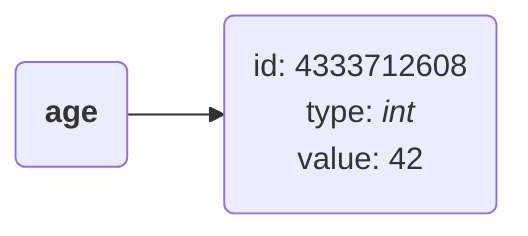
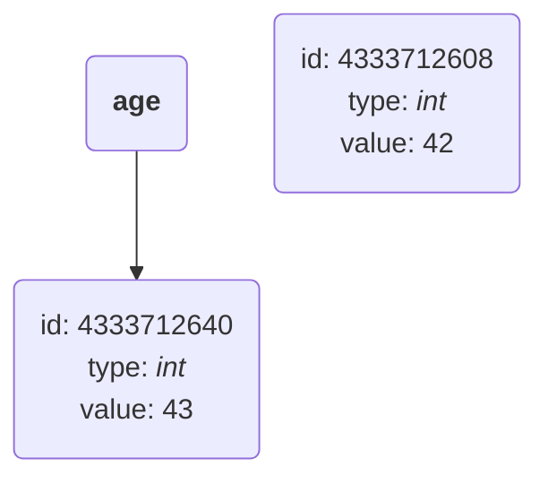

# 📖 Learning Log: Learn Python Programming by Fabrizio Romano & Heinrich Kruger

This repository documents my learning journey as I follow along and apply the concepts from the book [Learn Python Programming]() by [Fabrizio Romano]() and [Heinrich Kruger]().

## 🧭 Table of Contents

- [🧠 What I learned](#🧠-what-i-learned)
    - [Python objects & object mutability](#python-objects--object-mutability)
- [🌱 Continued Development](#🌱-continued-development)
- [📚 Useful resources](#📚-useful-resources)
- [👩🏽‍💻 Author](#👩🏽‍💻-author)

## 🧠 What I learned

### Python objects & object mutability

*Everything* in Python is an object. Every object has the following characteristics:

- an ```identity (ID)```
- a ```type```
- a ```value```

Below is an example of an instruction in ```Python```:

```python
name = 42
```

When the above instruction is executed, an object with an `id`, `type` and `value` is created. The name `age` is used to point to and retrieve the object depending on the scope of the instruction within the `Python` program.

This can be illustrated as follows:



Below, `age` is a name that is initially set to point to an *`int`* object of value `42`, which is **immutable** i.e., it cannot change.

Another *`int`* object of value `43` is then created and the name `age` is set to point to it.
Therefore, `42` was not changed to `43`, but the name `age` was set to point to a different location.

```bash
>>> age = 42
>>> id(age)
4333712608
>>> age = 43
>>> id(age)
4333712640
```



## 👩🏽‍💻 Author

| Platform | Link |
| :--- | :--- |
| **Technical Blog** | [https://grace-sampao.github.io/](https://grace-sampao.github.io/) |
| **LinkedIn** | [Grace Sampao](https://www.linkedin.com/in/grace-sampao) |
| **X (formerly Twitter)** | [@grace-sampao](https://x.com/grace_sampao) |
| **Email** | sampaograce@gmail.com |
