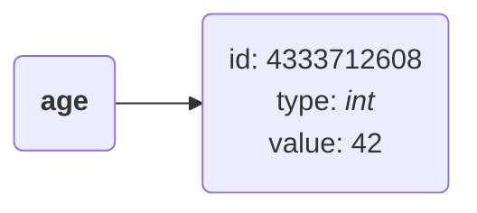
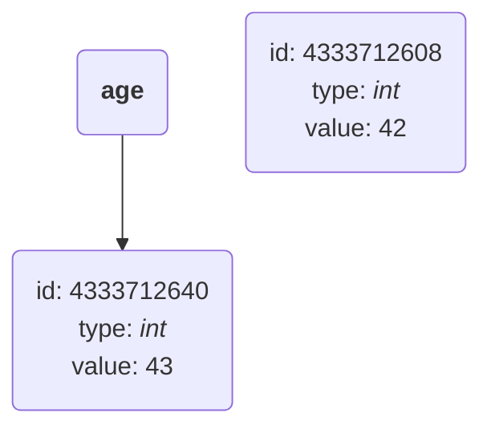
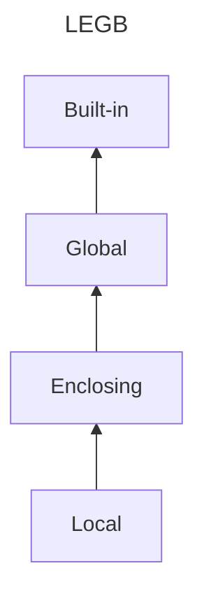

# 📖 Learning Log: Learn Python Programming by Fabrizio Romano & Heinrich Kruger

This repository documents my learning journey as I follow along and apply the concepts from the book [Learn Python Programming]() by [Fabrizio Romano]() and [Heinrich Kruger]().

## 🧭 Table of Contents

- [🧠 What I learned](#🧠-what-i-learned)
    - [Python objects & object mutability](#python-objects--object-mutability)
    - [Choosing the right data structure](#choosing-the-right-data-structure)
    - [Assignment expressions](#assignment-expressions)
    - [Scopes & namespaces](#scopes--namespaces)
- [🌱 Continued Development](#🌱-continued-development)
- [📚 Useful resources](#📚-useful-resources)
- [👩🏽‍💻 Author](#👩🏽‍💻-author)

## 🧠 What I learned

### Python objects & object mutability

*Everything* in Python is an object. Every object has the following characteristics:

- an ```identity (ID)```
- a ```type```
- a ```value```

Below is an example of an instruction in `Python`:

```python
name = 42
```

When the above instruction is executed, an object with an `id`, `type` and `value` is created. The name `age` is used to point to and retrieve the object depending on the scope of the instruction within the `Python` program.

This can be illustrated as follows:



Below, `age` is a name that is initially set to point to an *`int`* object of value `42`, which is **immutable** i.e., it cannot change.

Another *`int`* object of value `43` is then created and the name `age` is set to point to it.
Therefore, `42` was not changed to `43`, but the name `age` was set to point to a different location.

```bash
>>> age = 42
>>> id(age)
4333712608
>>> age = 43
>>> id(age)
4333712640
```



### Choosing the right data structure

Ease of use, performance and giving precedence to what matters the most within the context at hand strongly determine the data structure to be used.

A good indicator that the appropriate data structure has been used is the nature of the code written in order to manipulate it.

If the code logic comes easily and flows naturally, then the appropriate data structure has been selected. 
However, if the code gets unnecessarily complicated, then the choice of data structure may need to be reconsidered.

### Assignment expressions

These allow binding a value to a name in places where normal assignment statements aren't allowed e.g. in `if` and `while` statements.

Assignment expressions use `:=` (known as the **walrus operator**) instead of the normal assignment operator `=`.

When used in an `if` statement,

```python
value = 13
modulus = 5

remainder = value % modulus

if remainder:
    print(f"Not divisible! The remainder is {remainder}.")
```

becomes

```python
...

if remainder := value % modulus:
    print(f"Not divisible! The remainder is {remainder}.")
```

When simplifying a `while` loop,

```python
flavors = ["pistachio", "malaga", "vanilla", "chocolate"]
prompt: "Choose your flavor: "

print(flavors)

while True:
    choice = input(prompt)
    if choice in flavors:
        break
    print(f"Sorry, '{choice}' is not a valid option.")

print(f"You chose '{choice}'.")
```

becomes

```python
...

while (choice := input(prompt)) not in flavors:
    print(f"Sorry, '{choice}' is not a valid option.")

print(f"You chose '{choice}'.")
```

### Scopes & namespaces

`Python` searches for names in scopes according to the **LEGB** rule: **local**, **enclosing**, **global** and **built-in** scopes.



## 👩🏽‍💻 Author

| Platform | Link |
| :--- | :--- |
| **Technical Blog** | [https://grace-sampao.github.io/](https://grace-sampao.github.io/) |
| **LinkedIn** | [Grace Sampao](https://www.linkedin.com/in/grace-sampao) |
| **X (formerly Twitter)** | [@grace-sampao](https://x.com/grace_sampao) |
| **Email** | sampaograce@gmail.com |
